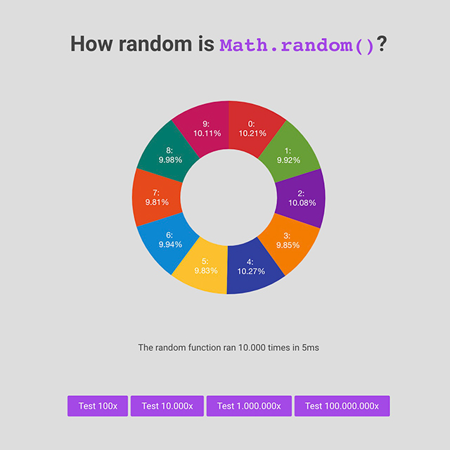

# 🚀 js-math-random-test
Have you ever wondered how accurate Javascript's `Math.random()` function actually is?

I thought about this the other day, so i decided to make a small experiment to find out.

🧪 You can try it out yourself [HERE](https://boguz.github.io/js-math-random-test/)

## 🧠 Some kind of conclusion
Depending on sample size, i was actually surprised to how random the results were.

With a small sample size (for instance just 100 tests), i got percentages as low as 5% and as high as 17% for each value (10 values in total).

But as i got to higher samples sizes (for instance 1.000.000) i got consistently values between 9.92% and 10.08%.

I have made these test using Chrome. As i understand it, it is actually the browser that implements how the `Math.random()` works, so there may be some differences between the browsers. It would be nice to test this some day...

## 📘 Articles
Here are some cool articles i found about this subject:
- [There’s Math.random(), and then there’s Math.random()](https://v8.dev/blog/math-random#:~:text=with%20ECMAScript%20internals-,Math.,This%20function%20takes%20no%20arguments.)
- [How does JavaScript’s Math.random() generate random numbers?](https://hackernoon.com/how-does-javascripts-math-random-generate-random-numbers-ef0de6a20131)
- [Math.random on MDN](https://developer.mozilla.org/en-US/docs/Web/JavaScript/Reference/Global_Objects/Math/random)

## 🦺 Disclaimer
This isn't scientific in any way, and there are many factors that can influence the results you get. This was just a fun little weekend project of mine, so please take the results and my conclusion for what they are...

## 📣 Shoutouts
- [Chart.js](https://www.chartjs.org/)
- [chartjs-plugin-datalabels](https://chartjs-plugin-datalabels.netlify.app/guide/)
